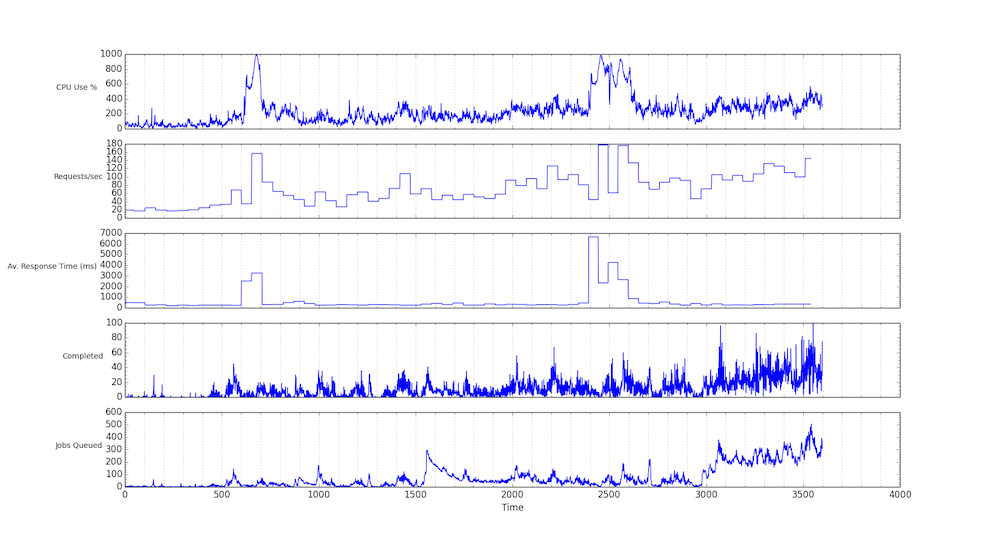

# CalendarServer Dashboard Service

## Overiew

The CalendarServer dashboard service is a way to visualize internal CalendarServer performance data, including HTTP, system, directory, and job queue statistics. At a high level it works as follows:

1. CalendarServer collects statistics internally and makes those available via a "stats socket" that can be read from to get the data.
2. A `dashcollect` tool is used to periodically read data from one or more CalendarServer hosts or pods and stores that data in a log file, as well as makes the data available to be read via a TCP socket.
3. A `dashview` tool can be run in a terminal window to show the statistics via multiple tables, using the `curses` terminal protocol.
4. A `dashtime` tool can be run to process the log file generated by `dashcollect` and display various plots of data over time.

## Detail

### Stats socket

The CalendarServer "stats socket" needs to be enabled in the caldavd.plist in order for the dashboard service to be active. To do that, make sure the following plist key is present:

    <key>Stats</key>
    <dict>
      <key>EnableTCPStatsSocket</key>
      <true/>
    </dict>

The default port for the "stats socket" is 8100, and can be changed by adding a `TCPStatsPort` item to the above plist key:

    <key>Stats</key>
    <dict>
      <key>EnableTCPStatsSocket</key>
      <true/>
      <key>TCPStatsPort</key>
      <integer>8100</integer>
    </dict>

CalendarServer can also provide a unix socket to read stats from, but that is only useful when the `dashcollect` tool is always run locally.

Internally CalendarServer collects the following data:

1. HTTP request data is collected via the access.log entries generated by each HTTP request. Request data is collected during each wall-clock minute, then averaged over periods of 1 minute, 5 minutes, and 1 hour. In addition, a snapshot of the HTTP request handling state of each child process is generated each time the "stats socket" is read from.
2. System statistics (CPU use, memory use, etc) are collected once per second.
3. Job queue statistics are collected each time the "stats socket" is read from. These include a snapshot of the overall state of the job queue table, as well as per-host data on how many jobs have been completed and their average execution time on each child process.
4. Directory statistics are collected as each directory request is executed.

### `dashcollect` tool

The `dashcollect` tool is a command line tool that periodically reads from one or more CalendarServer "stats sockets" and logs the resulting JSON data to a log file as well as making the most recent data available to be read over a TCP socket. The purpose of this tool is to have a single read of the "stats sockets" of a CalendarServer service, rather than having multiple tools reading from the CalendarServer service and creating additional load that could impact client-facing performance. The `dashcollect` data can be read by as many tools as needed without affecting performance. i.e., if ten people want to watch the CalendarServer performance over time, only one process is reading the `stats socket` on CalendarServer, but ten processes are reading from the `dashcollect` socket.

The JSON log file produced by `dashcollect` is in the form of a [JSON text sequence](https://tools.ietf.org/html/rfc7464). In addition, each JSON data text sequence can be compressed using zip and encoded as base64 text (compression greatly reduces the size of the log file and is recommended). The JSON data read from `dashcollect` TCP socket is standard JSON text (all text is utf-8 encoded).

#### Help

	dashcollect.py --help
	usage: dashcollect.py [-h] -f F -l L [-n] [-s S] [-t] [-z] [-v]
	
	Dashboard service for CalendarServer.
	
	optional arguments:
	  -h, --help  show this help message and exit
	  -f F        Server config file (see docstring for details)
	  -l L        Log file directory
	  -n          Create a new log file when starting, existing log file is
	              deleted (default: False)
	  -s S        Make JSON data available on the specified host:port (default:
	              localhost:8200)
	  -t          Rotate log files every hour, otherwise once per day (default:
	              False)
	  -z          zlib compress json records in log files (default: False)
	  -v          Verbose (default: False)
	
	To view the docstring, run: pydoc calendarserver/tools/dashcollect.py

* The `-f` option must be present and point to a config file (see below).
* The `-l` option must be present and point to an existing directory where the log files will be written. Log file names have the prefix `dashboard` followed by a timestamp and the file extension `.log`. Log files are rotated once per day, or once per hour as governed by the `-h` option.
* For CalendarServer services generating lots of data, the `-t` option is recommended to keep each log file to a reasonable size. Without this option there will be one log file per day (with the file name containing the date). With this option there will be one log file per hour (with the file name containing the date and hour).
* When generating lots of data it is recommended that the `-z` option is used to compress the JSON text sequences in the log files.

#### Config file

The config file (specified via `-f`) is used to define the set of CalendarServer pods and hosts to read stats data from. The file contains JSON data, and example:

    {
        "title": "My CalDAV service",
        "pods": {
            "podA": {
                "description": "Main pod",
                "servers": [
                    "podAhost1.example.com:8100",
                    "podAhost2.example.com:8100"
                ]
            },
            "podB": {
                "description": "Development pod",
                "servers": [
                    "podBhost1.example.com:8100",
                    "podBhost2.example.com:8100"
                ]
            }
        }
    }
    
* The `title` member is a descriptive title for the service.
* The `pods` object contains one item for each CalendarServer pod being monitored. The names used for the object keys will appear in the logs.
* The `description` member is a description for each pod.
* The `servers` object is an array of `host:port` values for each host in the pod, with the port set to the TCP stats socket used by that host.

### `dashview` tool

The `dashview` tool is a command line tool that periodically reads from a `dashcollect` socket and displays the data in a curses-based terminal using different table views for each class of data. The user can control which tables are visible at any time. The tool can show the data for any host in a multi-pod/multi-host CalendarServer service, and in addition can show the aggregated data for all hosts in a pod. This tool typically requires a large terminal window for viewing, and the terminal will need good curses support. This tool replaces the older `dashboard` tool which read stats directly from the CalendarServer hosts and is now considered deprecated since having multiple users using it causes service performance issues.

#### Help

	usage: dashview.py [-h] [-s S]
	
	Dashboard collector viewer service for CalendarServer.
	
	optional arguments:
	  -h, --help  show this help message and exit
	  -s S        Dashboard collector service host:port (default: localhost:8200)

* The `-s` option specifies the `dashcollect` service host and port where JSON data can be read from.

#### Panels

The visibility of each panel can be controlled via a "hotkey". In addition there are "hotkey"s that control the visibility of groups of panels:

* `h` toggle display of the _Help_ (hotkeys) panel
* `s` toggle display of the _System Status_ panel
* `r` toggle display of the _HTTP Requests_ panel
* `c` toggle display of the _HTTP Slots_ panel
* `m` toggle display of the _HTTP Methods_ panel
* `w` toggle display of the _Job Assignments_ panel
* `j` toggle display of the _Job Activity_ panel
* `d` toggle display of the _Directory Service_ panel
* `H` display all of the HTTP panels only
* `J` display all of the Jobs panels only
* `D` display all of the Directory panels only
* `a` display all panels
* `n` display no panels
* ` ` (space) toggle pause
* `t` toggle Update Speed between 0.1 secs and 1 sec.
* `x` toggle Aggregate Mode
* `q` Quit

Arrow keys can be used to select which pod or host data to view:

* `up` & `down` - move between the list of pods
* `left` & `right` - move between the list of hosts for the current pod

### `dashtime` tool

The `dashtime` tool can produce plots of `dashcollect` logged data, to show how that data changes over time. Note that the Python `matplotlib` module is a requirement (do `pip install matplotlib` if you get an import error running the tool). This tool can produce a set of vertically stacked plots that show the variation of various server stats over time. The stats can be aggregated for all hosts in a pod, or for a single host, or a combination of plots for each host and the aggregated values. Specific plot "modes" have been hard-coded to produce common sets of plots. Plots are by default displayed on screen from where they can be saved, but an option to automatically save a PNG image also exists.

#### Help

	dashtime.py --help
	usage: dashtime.py [-h] -l L [-p P] [-s S] [--save] [--noshow] [--start START]
	                   [--count COUNT]
	                   [--mode {basic,basicjob,basicmethod,basicschedule,hostcompleted,hostcpu,hostrequests}]
	                   [-v]
	
	Dashboard time series processor.
	
	optional arguments:
	  -h, --help            show this help message and exit
	  -l L                  Log file to process
	  -p P                  Name of pod to analyze
	  -s S                  Name of server to analyze
	  --save                Save plot PNG image (default: False)
	  --noshow              Don't show the plot on screen (default: False)
	  --start START         Log line to start from (default: 0)
	  --count COUNT         Number of log lines to process from start (default:
	                        -1)
	  --mode {basic,basicjob,basicmethod,basicschedule,hostcompleted,hostcpu,hostrequests}
	                        Type of plot to produce (default: basic)
	  -v                    Verbose (default: False)
	
	Available modes:
	
	basic - stacked plots of total CPU, total request count, total average response
	    time, completed jobs, and job queue size.
	
	basicjob - as per basic but with queued SCHEDULE_*_WORK and queued
	    PUSH_NOTIFICATION_WORK plots.
	
	basicschedule - stacked plots of total CPU, completed jobs, each queued
	    SCHEDULE_*_WORK, queued, PUSH_NOTIFICATION_WORK, and overall job queue size.
	
	basicmethod - stacked plots of total CPU, total request count, total average
	    response time, PUT-ics, REPORT cal-home-sync, PROPFIND Calendar Home, REPORT
	    cal-sync, and PROPFIND Calendar.
	
	hostrequests = stacked plots of per-host request counts, total request count,
	    and total CPU.
	
	hostcpu = stacked plots of per-host CPU, total request count, and total CPU.
	
	hostcompleted = stacked plots of per-host completed jobs, total CPU, and job
	    queue size.

* The `-l` option must be present and point to a `dashcollect` log file.
* The `-p` option defines the pod to view data for (if not present the first pod - alphabetically sorted - is used).
* The `-s` option defines a specific server to view data for (there are currently no modes that use this).
* The `--save` option, when present, will cause a PNG image of the plots to be saved to disk. The image file has the same name as the log file, but with the mode name and a `.png` suffix appended, and it will be created in the same directory as the log file.
* The `--noshow` option, when present, supresses display of the plots on screen.
* The `--start` option specifies which line in the `dashcollect` log file to start reading from (default is the first line).
* The `--count` option specifies the maximum number of lines to read from the start (default is all lines after the start).
* The `--mode` option determines the type of data produced in the plots. Each mode is described in the help text above.

Note that the time scale on the plots is typically one second, as that is the polling period used by `dashcollect`. The HTTP-related data comes from one minute averages, so will look "blocky" compared to the once per-second values of the other stats. The one minute average data is shifted lower by 60 seconds to better match it to the time over which the data was actually collected.

Example of a "basic" mode image:

